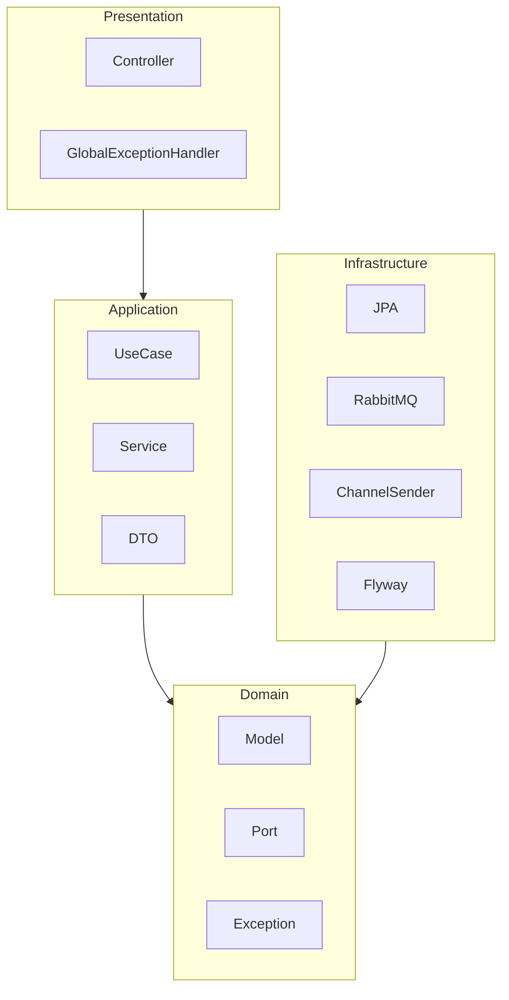

# NotifyFlow

> Motor de notificações multi-canal assíncrono com garantia de entrega.

[](https://github.com/joaogabriel43/notifyflow/actions/workflows/ci.yml)

---

## 🎯 Sobre o projeto

Sistemas de notificação frágeis são um problema recorrente na indústria: emails que falham silenciosamente, SMS entregues fora de ordem e notificações push que simplesmente somem. Quando um canal cai, a mensagem é perdida — e ninguém percebe até que um cliente reclame.

**NotifyFlow** resolve isso centralizando o envio de notificações multi-canal com garantia de entrega. A arquitetura garante que cada notificação é persistida antes de entrar na fila, processada de forma assíncrona e redirecionada automaticamente para o próximo canal disponível caso o preferido falhe (EMAIL → SMS → PUSH). O sistema foi projetado para ser multi-tenant desde o início, com isolamento de rate limit por tenant e endpoints para reprocessamento de falhas.

---

## ✨ Funcionalidades

- ⚡ **Motor assíncrono** com RabbitMQ e Outbox Pattern — nenhuma mensagem é perdida
- 🔄 **Fallback automático** entre canais (EMAIL → SMS → PUSH) controlado pelo domínio
- 🛡️ **Circuit Breaker + Retry** com Resilience4j — tolerância a falhas em provedores externos
- 🚦 **Rate limiting por tenant** (100 req/min) — isolamento e proteção contra abuso
- ☠️ **Dead Letter Queue** com reprocessamento via endpoint `POST /api/v1/notifications/{id}/retry`
- 📊 **Dashboard Angular** com métricas em tempo real, gráfico de entregas por canal e timeline de tentativas
- 📧 **Integração SendGrid** — email real em produção, stub em desenvolvimento via `@ConditionalOnProperty`
- 📄 **API REST** com documentação Swagger/OpenAPI disponível em `/swagger-ui.html`

---

## 🏗️ Arquitetura

### Fluxo completo de uma notificação

```mermaid
graph LR
    Client-->|POST /api/v1/notifications|API
    API-->|@Transactional|DB[(PostgreSQL)]
    API-->|save outbox|DB
    Scheduler-->|poll PENDING|DB
    Scheduler-->|publish|RabbitMQ
    RabbitMQ-->Consumer
    Consumer-->|EMAIL|SendGrid
    Consumer-->|SMS|Twilio
    Consumer-->|PUSH|Firebase
    Consumer-->|update status|DB
    SendGrid-->|failed|DLQ
    DLQ-->DeadLetterConsumer
    DeadLetterConsumer-->|mark FAILED|DB
```

### Clean Architecture — dependências entre camadas



A regra de dependência é estrita: as camadas internas (`Domain`, `Application`) nunca conhecem as externas. A `Infrastructure` implementa as interfaces (`Port`) definidas no domínio — não o contrário.

---

## 🛠️ Stack e justificativas

| Tecnologia | Versão | Justificativa |
|---|---|---|
| Java | 17 LTS | Records, Sealed Classes, maior adoção enterprise; suporte até 2029 |
| Spring Boot | 3.2 | Suporte nativo a Virtual Threads, auto-configuration madura, ecossistema amplo |
| RabbitMQ | 3.x | DLQ nativa, protocolo AMQP maduro, ideal para garantia de entrega com retry configurável |
| Outbox Pattern | — | Elimina a janela de falha entre `INSERT` no DB e `publish` na fila sem transação distribuída |
| Resilience4j | 2.x | Circuit Breaker leve e nativo para Spring Boot 3; Hystrix foi descontinuado |
| PostgreSQL | 16 | JSONB para `templateVariables` variáveis, partial indexes no outbox para performance |
| Flyway | 9.x | Migrations versionadas, auditáveis, reversíveis — sem mudanças de schema ad-hoc |
| Testcontainers | 1.19 | Testes de integração com infra real (PostgreSQL + RabbitMQ), não H2 nem mocks de broker |
| Angular | 17 | Signals para estado reativo sem complexidade do NgRx, lazy loading nativo, standalone components |
| Angular Material | 17 | Design system completo sem CSS custom; componentes acessíveis por padrão |
| ngx-echarts | 17 | Wrapper Angular do Apache ECharts — rico em tipos de gráfico com bundle razoável |
| SendGrid | 4.x | API REST bem documentada, SDK Java oficial, plano gratuito para 100 emails/dia |
| Docker | multi-stage | Imagens menores (JRE ao invés de JDK, nginx ao invés de Node em produção) |

---

## 🚀 Como executar localmente

**Pré-requisitos**: Java 17, Docker, Node 20

```bash
# 1. Subir a infraestrutura (PostgreSQL + RabbitMQ)
docker-compose up -d

# 2. Backend (aguarde o PostgreSQL estar pronto)
mvn spring-boot:run

# 3. Frontend (em outro terminal)
cd frontend
npm install
npx ng serve
```

| Serviço | URL |
|---|---|
| API REST | http://localhost:8080 |
| Swagger UI | http://localhost:8080/swagger-ui.html |
| Dashboard Angular | http://localhost:4200 |
| RabbitMQ Management | http://localhost:15672 (guest/guest) |

---

## 🔑 Variáveis de ambiente

Copie `.env.example` para `.env` e preencha os valores:

| Variável | Padrão | Descrição |
|---|---|---|
| `DB_URL` | `jdbc:postgresql://localhost:5432/notifyflow` | URL JDBC do PostgreSQL |
| `DB_USERNAME` | `postgres` | Usuário do banco |
| `DB_PASSWORD` | _(vazio)_ | Senha do banco |
| `RABBITMQ_HOST` | `localhost` | Host do RabbitMQ |
| `RABBITMQ_PORT` | `5672` | Porta AMQP |
| `RABBITMQ_USERNAME` | `guest` | Usuário RabbitMQ |
| `RABBITMQ_PASSWORD` | `guest` | Senha RabbitMQ |
| `EMAIL_PROVIDER` | `stub` | `stub` (dev) ou `sendgrid` (prod) |
| `SENDGRID_API_KEY` | — | API key do SendGrid (produção) |
| `FROM_EMAIL` | — | Email remetente (produção) |

---

## 🧪 Testes

```bash
# Testes unitários — sem dependência de Docker
mvn test -Dtest="*Test"

# Suite completa — requer Docker (Testcontainers)
docker-compose up -d
mvn verify

# Frontend — requer browser instalado
cd frontend && npx ng test --watch=false
```

A cobertura inclui:
- **Testes de domínio**: todas as transições de status da entidade `Notification`
- **Testes unitários de serviço**: `SendGridEmailSender`, `TenantRateLimiterService`
- **Testes de integração**: fluxo completo `POST → Outbox → RabbitMQ → Consumer → Delivery` via Testcontainers
- **Testes de controller**: endpoints REST com MockMvc incluindo cenários de retry e rate limit (429)
- **Testes Angular**: `NotificationService`, `StatusBadgeComponent`, `NotificationFormComponent`

---

## 🎯 Desafios técnicos resolvidos

**1. Consistência entre banco e fila com o Outbox Pattern**

O maior risco em sistemas assíncronos é gravar a notificação no banco e falhar antes de publicar na fila. A solução ingênua — gravar e publicar na mesma função — não é atômica. O Outbox Pattern resolve isso gravando a notificação e um registro em `notification_outbox` na mesma transação. Um scheduler independente lê os registros `PENDING` e os publica na fila, garantindo que qualquer mensagem salva no banco eventualmente chegue ao consumer — mesmo após restarts da aplicação.

**2. Fallback entre canais controlado pelo domínio**

A lógica de fallback (EMAIL falhou → tenta SMS → tenta PUSH) poderia facilmente vazar para a infraestrutura, criando acoplamento entre o consumer RabbitMQ e os provedores externos. A solução foi encapsular essa lógica na entidade `Notification` através dos métodos `hasMoreChannels()` e `getNextChannel()`. O consumer apenas pergunta ao domínio qual canal tentar a seguir — nunca toma essa decisão sozinho. Isso torna o fallback testável unitariamente, sem precisar mockar RabbitMQ, SendGrid ou qualquer infraestrutura.

**3. Rate limiter dinâmico por tenant**

Um rate limiter global não serve para um sistema multi-tenant: um tenant abusivo bloquearia os demais. Criar um bean Spring separado por tenant é inviável em runtime. A solução foi usar o `RateLimiterRegistry` do Resilience4j, que suporta criação dinâmica de `RateLimiter` instâncias com configuração nomeada (`default-tenant`). Cada tenant recebe seu próprio limiter criado preguiçosamente na primeira requisição, com isolamento total e overhead proporcional apenas ao número de tenants ativos, não ao número de requisições.

**4. Testes de integração com mensageria assíncrona**

Testar um consumer RabbitMQ é intrinsecamente assíncrono: publicar na fila e verificar o efeito no banco de dados tem uma janela de tempo indeterminada. O uso de `Thread.sleep()` tornaria os testes lentos e frágeis. A solução foi combinar Testcontainers (PostgreSQL e RabbitMQ reais, sem mocks) com a biblioteca Awaitility, que permite fazer assertions com polling configurável: `await().atMost(10, SECONDS).until(() -> notificationRepository.findById(id).map(n -> n.getStatus() == DELIVERED).orElse(false))`. Os testes são determinísticos sem ser lentos.

---

## 📁 Estrutura do projeto

```
NotifyFlow/
├── src/main/java/com/joaogabriel/notifyflow/
│   ├── domain/                     # Regras de negócio puras
│   │   ├── model/                  # Notification, DeliveryAttempt, RecipientInfo
│   │   ├── enums/                  # NotificationStatus, Channel
│   │   ├── exception/              # ChannelDeliveryException, RateLimitExceededException
│   │   └── port/out/               # NotificationRepositoryPort (interface)
│   ├── application/                # Orquestração dos casos de uso
│   │   ├── usecase/                # SendNotificationUseCase, RetryNotificationUseCase
│   │   ├── service/                # SendNotificationService, RetryNotificationService
│   │   └── dto/                    # SendNotificationRequest, NotificationResponse
│   ├── infrastructure/             # Implementações técnicas
│   │   ├── persistence/            # JPA entities, repositories, adapters, mappers
│   │   ├── messaging/              # RabbitMQ publisher, consumer, config
│   │   ├── channel/                # EmailChannelSender, SendGridEmailSender, stubs
│   │   ├── ratelimit/              # TenantRateLimiterService
│   │   └── config/                 # RabbitMQConfig, SendGridConfig, CorsConfig
│   └── presentation/               # Camada HTTP
│       ├── controller/             # NotificationController
│       └── exception/              # GlobalExceptionHandler (RFC 7807)
├── frontend/                       # Dashboard Angular 17
│   └── src/app/
│       ├── core/                   # Services, models, interceptors
│       ├── features/               # Dashboard, notification list/form/detail
│       └── shared/                 # StatusBadge, ChannelIcon, pipes
├── src/main/resources/db/migration/ # Flyway migrations (V1__ a V4__)
├── docker-compose.yml              # PostgreSQL + RabbitMQ para desenvolvimento local
├── Dockerfile                      # Backend multi-stage (JDK builder → JRE runtime)
├── frontend/Dockerfile             # Frontend multi-stage (Node builder → nginx runtime)
└── .github/workflows/ci.yml        # GitHub Actions CI
```

---

## 📄 Licença

MIT — livre para uso, modificação e distribuição.
